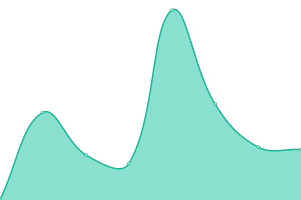
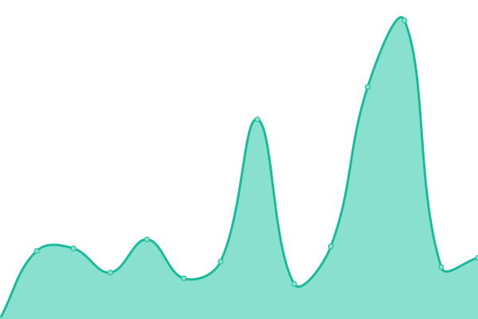

# [📈 Live Status](https://jermynstreettheatre.github.io/status): <!--live status--> **🟧 Partial outage**

This repository contains the open-source uptime monitor and status page for [Jermyn Street Theatre](https://www.jermynstreettheatre.co.uk), powered by [Upptime](https://github.com/upptime/upptime).

With [Upptime](https://upptime.js.org), you can get your own unlimited and free uptime monitor and status page, powered entirely by a GitHub repository. We use [Issues](https://github.com/jermynstreettheatre/status/issues) as incident reports, [Actions](https://github.com/jermynstreettheatre/status/actions) as uptime monitors, and [Pages](https://jermynstreettheatre.github.io/status) for the status page.

<!--start: status pages-->
<!-- This summary is generated by Upptime (https://github.com/upptime/upptime) -->
<!-- Do not edit this manually, your changes will be overwritten -->
<!-- prettier-ignore -->
| URL | Status | History | Response Time | Uptime |
| --- | ------ | ------- | ------------- | ------ |
|  [GAVIN](https://assets.technical.jermynstreettheatre.co.uk) | 🟩 Up | [gavin.yml](https://github.com/jermynstreettheatre/status/commits/HEAD/history/gavin.yml) | 

 1489ms
     
 | 

<a href="https://status.technical.jermynstreettheatre.co.uk/history/gavin">100.00%</a>
    

|  [Vaultwarden](https://vault.technical.jermynstreettheatre.co.uk) | 🟥 Down | [vaultwarden.yml](https://github.com/jermynstreettheatre/status/commits/HEAD/history/vaultwarden.yml) | 

 859ms
     
 | 

<a href="https://status.technical.jermynstreettheatre.co.uk/history/vaultwarden">24.84%</a>
    

|  [Email IMAP](mail.jermynstreettheatre.co.uk) | 🟩 Up | [email-imap.yml](https://github.com/jermynstreettheatre/status/commits/HEAD/history/email-imap.yml) | 

 96ms
     
 | 

<a href="https://status.technical.jermynstreettheatre.co.uk/history/email-imap">100.00%</a>
    

|  [Email POP3](mail.jermynstreettheatre.co.uk) | 🟩 Up | [email-pop-3.yml](https://github.com/jermynstreettheatre/status/commits/HEAD/history/email-pop-3.yml) | 

 96ms
     
 | 

<a href="https://status.technical.jermynstreettheatre.co.uk/history/email-pop-3">100.00%</a>
    

|  [Email SMTP](mail.jermynstreettheatre.co.uk) | 🟩 Up | [email-smtp.yml](https://github.com/jermynstreettheatre/status/commits/HEAD/history/email-smtp.yml) | 

 96ms
     
 | 

<a href="https://status.technical.jermynstreettheatre.co.uk/history/email-smtp">100.00%</a>
    

|  [Public website](https://www.jermynstreettheatre.co.uk) | 🟩 Up | [public-website.yml](https://github.com/jermynstreettheatre/status/commits/HEAD/history/public-website.yml) | 

 1100ms
     
 | 

<a href="https://status.technical.jermynstreettheatre.co.uk/history/public-website">100.00%</a>
    

|  [UniFi remote access](https://status.ui.com) | 🟩 Up | [uni-fi-remote-access.yml](https://github.com/jermynstreettheatre/status/commits/HEAD/history/uni-fi-remote-access.yml) | 

 297ms
     
 | 

<a href="https://status.technical.jermynstreettheatre.co.uk/history/uni-fi-remote-access">100.00%</a>
    

|  [Google Workspace](https://www.google.com/appsstatus/dashboard) | 🟩 Up | [google-workspace.yml](https://github.com/jermynstreettheatre/status/commits/HEAD/history/google-workspace.yml) | 

 149ms
     
 | 

<a href="https://status.technical.jermynstreettheatre.co.uk/history/google-workspace">67.19%</a>
    

|  [Dropbox](https://status.dropbox.com) | 🟩 Up | [dropbox.yml](https://github.com/jermynstreettheatre/status/commits/HEAD/history/dropbox.yml) | 

 288ms
     
 | 

<a href="https://status.technical.jermynstreettheatre.co.uk/history/dropbox">99.71%</a>
    

|  [Hostinger](https://statuspage.hostinger.com) | 🟨 Degraded | [hostinger.yml](https://github.com/jermynstreettheatre/status/commits/HEAD/history/hostinger.yml) | 

 411ms
     
 | 

<a href="https://status.technical.jermynstreettheatre.co.uk/history/hostinger">39.66%</a>
    

|  [Soldo](https://status-page-internal.soldocloud.net) | 🟨 Degraded | [soldo.yml](https://github.com/jermynstreettheatre/status/commits/HEAD/history/soldo.yml) | 

 697ms
     
 | 

<a href="https://status.technical.jermynstreettheatre.co.uk/history/soldo">4.93%</a>
    

|  [Worldpay](https://status.worldpay.com) | 🟩 Up | [worldpay.yml](https://github.com/jermynstreettheatre/status/commits/HEAD/history/worldpay.yml) | 

 342ms
     
 | 

<a href="https://status.technical.jermynstreettheatre.co.uk/history/worldpay">99.05%</a>
    

|  [Nimvelo](http://status.nimvelo.com) | 🟩 Up | [nimvelo.yml](https://github.com/jermynstreettheatre/status/commits/HEAD/history/nimvelo.yml) | 

 832ms
     
 | 

<a href="https://status.technical.jermynstreettheatre.co.uk/history/nimvelo">100.00%</a>
    

<!--end: status pages-->

[**Visit our status website →**](https://jermynstreettheatre.github.io/status)

## 📄 License

- Powered by: [Upptime](https://github.com/upptime/upptime)
- Code: [MIT](./LICENSE) © [Anand Chowdhary](https://anandchowdhary.com), supported by [Pabio](https://pabio.com)
- Data in the `./history` directory: [Open Database License](https://opendatacommons.org/licenses/odbl/1-0/)
